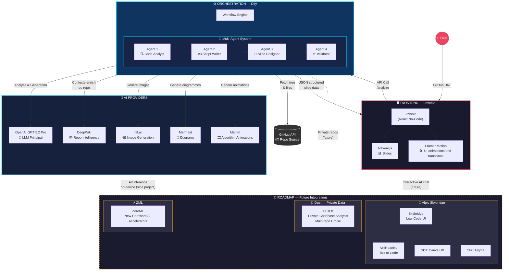

# 🎬 CodeTale

**Transform GitHub repositories into cinematic stories, interactive slides, and data‑driven visualizations — powered by AI.**


[📄 View presentation slides](documentation/CodeTalePitchPresentation.pdf)
[📹 Watch Deep Dive Video](demo_videos/AlpicSkybridgeDemo.mp4)

> 🏆 **{Tech: Europe} Paris AI Hackathon 2026** — Built in 48 hours in Paris.

---

## 🏗️ Architecture



> **Note**: If the Mermaid diagram doesn't render in your environment, view the [PNG version](documentation/Overview.png).


---


---

## 🏗️ Partner Technologies Used

> **Hackathon requirement: minimum 3 partner technologies.** CodeTale uses **7**.

| # | Partner | Usage in CodeTale | Category |
|---|---------|-------------------|----------|
| 1 | **[Lovable](https://lovable.dev)** | Full‑stack development platform. Frontend, backend (Edge Functions), database, deployment — all built with Lovable. | Infrastructure |
| 2 | **[OpenAI](https://openai.com)** | GPT‑5.2 for slide generation & repository analysis. GPT‑4.1 / GPT‑4.1‑mini as fallback providers. Direct OpenAI API supported alongside Lovable AI gateway. | AI Models |
| 3 | **[fal.ai](https://fal.ai)** | flux/dev model for generating minimalist slide illustrations when no rich visualization (Mermaid, chart, code animation) is available. | Generative Media |
| 4 | **[Gradium](https://gradium.ai)** | Text‑to‑speech narration in 3 languages (English, French, German). Powers continuous Cinema Mode voiceover and per‑slide audio in Slide Mode. | Voice AI |
| 5 | **[Alpic Skybridge](https://alpic.ai)** | ChatGPT App integration — analyze repos, compare projects, generate pitch decks directly inside ChatGPT via MCP. | ChatGPT Apps |
| 6 | **[Dify](https://dify.ai)** | Multi‑agent orchestration (in progress) for advanced analysis pipelines. | AI Agents |
| 7 | **[Dust](https://dust.tt)** | Private multi‑repository analysis for enterprise use cases (exploring). | AI Platform |

### Additional Technologies
| Technology | Role |
|------------|------|
| [OpenAI Codex](https://openai.com/index/openai-codex/) | Code understanding and generation for repository analysis |
| [DeepWiki](https://deepwiki.com) | AI‑analyzed documentation for deeper architectural context |
| [ZeroML/ZML](https://zml.ai) | High‑performance inference exploration |
| [Recharts](https://recharts.org) | Animated data visualizations |
| [Mermaid](https://mermaid.js.org) | UML diagrams (flowchart, sequence, class, state) |
| [Framer Motion](https://www.framer.com/motion) | UI animations and transitions |

---


## 🌟 The Problem

Developers struggle to:
- Create engaging demos of their projects
- Present technical concepts visually
- Explain complex algorithms and data flows
- Spend hours on content creation instead of coding

**CodeTale turns any GitHub repo into a cinematic presentation in minutes, not hours.**

---

## ✨ What's Implemented

### Core Pipeline
1. **Repository Analysis** — Deep multi‑step analysis engine:
   - Fetches repo metadata, README, file tree, and language stats from GitHub API
   - Fetches AI‑analyzed documentation from [DeepWiki](https://deepwiki.com)
   - Discovers and classifies images (screenshots, architecture diagrams) from README and asset folders
   - Adaptive file budgeting: Small <30 files → all; Medium 30–100 → top 25; Large >100 → top 20
   - 6‑tier file prioritization: Identity → Config → Entry Points → Keywords → Shallow → Deep
   - Smart truncation: Files >300 lines keep first 100 + last 50 lines

2. **Slide Generation** — 6‑slide cinematic narrative:
   - AI generates: Hook → Overview → Architecture → Features/Data → Code/Algorithm → Impact
   - Publication‑quality Mermaid UML diagrams (flowcharts, class, sequence, state diagrams)
   - Mandatory step‑by‑step code animations on every presentation
   - Animated charts with real repository metrics (Recharts)
   - Data structure visualizations (Arrays, Trees, Graphs, Stacks, Queues, Linked Lists)

3. **Media Production**:
   - Narration audio via Gradium TTS (English 🇬🇧, French 🇫🇷, German 🇩🇪)
   - AI illustrations via fal.ai (flux/dev) — only when no rich visualization exists
   - Ken Burns effect (zoom/pan) on images for dynamic visuals
   - Repository screenshots and diagrams used as native slide visuals

### AI Provider Cascade
CodeTale supports **both** direct OpenAI API access and the Lovable AI gateway with automatic failover:

```
Priority 1: OpenAI Direct API  → gpt-5.2-pro (best, ChatGPT Pro)
Priority 2: Lovable AI Gateway → openai/gpt-5.2 (gateway fallback)
Priority 3: OpenAI Direct API  → gpt-4o-mini (cheapest fallback)
```

If one provider fails (rate limit, credits exhausted, auth error), the system automatically cascades to the next. This ensures **zero downtime** for slide generation.

---

## 🎬 Features

### Three Viewing Modes
| Mode | Description | Access |
|------|-------------|--------|
| 🎬 **Cinema** *(recommended)* | Autoplay with continuous narration, cinematic crossfade, auto‑scroll, Netflix‑style overlay controls. Fully hands‑free. | Mode selection screen + top bar |
| 📊 **Slides** | Manual navigation with on‑demand audio. Arrow keys, click, or dot indicators. | Mode selection screen + top bar |
| 🔬 **Analysis** | Full technical dashboard: architecture, complexity, patterns, audience insights, discovered repo images. | Top bar tab |

### Rich Visualizations
- **Mermaid UML diagrams** on multiple slides — click to zoom fullscreen
- **Animated charts** (Bar, Line, Area, Pie, Radar) with real data
- **Code stepper** — line‑by‑line highlighting synced to narration (mandatory on every presentation)
- **Data structure animations** — SVG visualizations with step‑by‑step state changes
- **Ken Burns effect** on images for cinematic feel
- **Smart media hierarchy** — technical content prioritized over AI illustrations

### Stability & Reliability
- 3‑level AI provider cascade with automatic failover
- Mermaid syntax sanitization + offscreen rendering
- Concurrency guards (`isGeneratingRef`, `isTransitioningRef`, 2‑min timeout)
- Per‑IP rate limiting on public API (10 req/min)

### Export & API
- **Download** standalone HTML presentation
- **Public API**: `POST /functions/v1/analyze-repo` with configurable `max_files`, `target_audience`
- **API docs**: `/api-docs` page with cURL, JavaScript, Python examples

---

## 🎥 Demo Gallery

### Explore Existing Codebases

Try CodeTale with these curated examples:

| Project | Repository | Highlights |
|---------|------------|------------|
| **Apollo 11** | [chrislgarry/Apollo-11](https://github.com/chrislgarry/Apollo-11) | AGC guidance computer, mission‑critical code walkthrough |
| **MS-DOS** | [microsoft/MS-DOS](https://github.com/microsoft/MS-DOS) | INT 21h interrupt handler animation, system architecture |
| **Sorting Algorithms** | [TheAlgorithms/Python](https://github.com/TheAlgorithms/Python) | Bubble, merge, quick sort — animated with data structures |
| **Data Science Olympics** | [drivendataorg/cookiecutter-data-science](https://github.com/drivendataorg/cookiecutter-data-science) | Data science project structure and best practices |

### From Partners

See CodeTale in action with our hackathon partners' own codebases:

| Partner | Repository | What CodeTale Reveals |
|---------|------------|----------------------|
| **Alpic Skybridge** | [alpic-ai/skybridge](https://github.com/alpic-ai/skybridge) | MCP server architecture, ChatGPT app integration patterns • [📹 Watch Demo](demo_videos/AlpicSkybridgeDemo.mp4) |
| **Gradium** | [gradium-ai/gradium-python](https://github.com/gradium-ai/gradium-python) | TTS API client, multilingual voice synthesis |
| **OpenAI Cookbook** | [openai/openai-cookbook](https://github.com/openai/openai-cookbook) | GPT integration patterns, prompt engineering examples |
| **Dify** | [langgenius/dify](https://github.com/langgenius/dify) | Multi-agent orchestration, LLM workflow engine |
| **Dust** | [dust-tt/dust](https://github.com/dust-tt/dust) | Enterprise AI platform, private codebase analysis |
| **fal.ai JS Client** | [fal-ai/fal-js](https://github.com/fal-ai/fal-js) | Image generation API, TypeScript SDK patterns |
| **ZeroML** | [zml/zml](https://github.com/zml/zml) | High-performance ML inference, hardware acceleration |

> 💡 **Try it yourself**: Paste any GitHub URL into CodeTale and watch it generate a cinematic presentation in minutes!

---


## 🧰 Tech Stack

| Category | Technology |
|----------|------------|
| **Frontend** | Vite, React, TypeScript |
| **UI** | Tailwind CSS, shadcn/ui, Radix UI |
| **Animation** | Framer Motion |
| **Charts** | Recharts |
| **Diagrams** | Mermaid (flowchart, sequence, class, state) |
| **Backend** | Supabase Edge Functions (Deno) via Lovable Cloud |
| **AI — Primary** | OpenAI Direct API → GPT‑5.2‑pro (ChatGPT Pro) |
| **AI — Fallback** | Lovable AI Gateway (GPT‑5.2) / OpenAI (GPT‑4o‑mini) |
| **Voice** | Gradium TTS (multilingual) |
| **Images** | fal.ai (flux/dev) |
| **Analysis** | DeepWiki (deepwiki.com) |
| **ChatGPT App** | Alpic Skybridge (MCP) |

---

## 🚀 Quickstart

### 1. Install dependencies
```sh
npm install
```

### 2. Configure frontend environment
- `VITE_SUPABASE_URL`
- `VITE_SUPABASE_PUBLISHABLE_KEY`

### 3. Run the dev server
```sh
npm run dev
```

### 4. Edge Function secrets

| Secret | Required | Purpose |
|--------|----------|---------|
| `LOVABLE_API_KEY` | ✅ | AI slide generation (primary provider) |
| `OPENAI_API_KEY` | Optional | Direct OpenAI fallback (GPT‑4.1 / GPT‑4.1‑mini) |
| `FAL_API_KEY` | ✅ | Image generation (fal.ai flux/dev) |
| `GRADIUM_API_KEY` | ✅ | TTS narration (Gradium) |
| `GITHUB_TOKEN` | Optional | Private repos & higher rate limits (5,000 req/hr vs 60) |

---

## 🔄 Roadmap

| Phase | Feature | Status |
|-------|---------|--------|
| ✅ MVP | Cinema + Slides generation | Done |
| ✅ MVP | Deep repository analysis engine | Done |
| ✅ MVP | Multi‑diagram UML support (class, sequence, state) | Done |
| ✅ MVP | Mandatory code animations | Done |
| ✅ MVP | Image discovery & classification | Done |
| ✅ MVP | Diagram zoom modal | Done |
| ✅ MVP | Analysis tab in viewer | Done |
| ✅ MVP | Public analysis API | Done |
| ✅ MVP | 3‑level AI cascade (Lovable + OpenAI) | Done |
| ✅ MVP | Alpic Skybridge server ready, ChatGPT App in progress | Done |
| 🔜 Next | Dify multi‑agent orchestration | Planned |
| 💡 Future | Dust — enterprise multi‑repo analysis | Exploring |
| 💡 Future | ZML high‑performance inference | Exploring |

---

## 📋 Hackathon Submission Checklist

- [x] Public GitHub repository with source code
- [x] Comprehensive README with setup instructions
- [x] Documentation of all APIs, frameworks, and tools
- [x] Uses 7 partner technologies (min. 3 required): Lovable, OpenAI, fal.ai, Gradium, Alpic, Dify, Dust
- [x] 2‑minute video demo: [Watch Video](demo_videos/AlpicSkybridgeDemo.mp4)
- [x] Live deployment via Lovable

---

## 🙏 Acknowledgments

### Featured Partners
- **[Lovable](https://lovable.dev)** — Full‑stack AI development platform
- **[OpenAI](https://openai.com)** — GPT‑5.2, GPT‑4.1, GPT‑4.1‑mini model family
- **[fal.ai](https://fal.ai)** — Generative media platform (flux/dev)
- **[Gradium](https://gradium.ai)** — Voice AI / TTS

### Technology Partners
- **[Alpic](https://alpic.ai)** — ChatGPT App platform (Skybridge)
- **[Dify](https://dify.ai)** — Open‑source AI agent platform
- **[Dust](https://dust.tt)** — AI agent platform for enterprises
- **[ZeroML](https://zml.ai)** — High‑performance inference
- **[DeepWiki](https://deepwiki.com)** — AI‑analyzed documentation
- **[OpenAI Codex](https://openai.com)** — Development companion

---

## 👤 Author

**Wilfred Doré**

Built with ❤️ at {Tech: Europe} Paris AI Hackathon 2026

<div align="center">
</div>


---

## 💬 Conversational Interface (Alpic Skybridge)

CodeTale includes a **Skybridge ChatGPT App** that lets you interact with CodeTale directly inside **ChatGPT** via MCP.

### ChatGPT App Features
| Action | Description |
|--------|-------------|
| **Analyze Repo** | Structured summary of any GitHub repository |
| **Explain Architecture** | Architecture diagrams rendered in chat |
| **Compare Repos** | Side‑by‑side comparison of two repositories |
| **Generate Pitch Deck** | Slide deck from a repo URL |

### ✅ Latest Features (v2)
- **Visual Architecture Diagrams**: Repositories now display interactive Mermaid diagrams directly in the chat interface.

🚀 **Production URL:** `https://codetale-skybridge-a-24b76a95.alpic.live`

### Connecting to ChatGPT (Manual Setup)
You cannot "push" a GPT configuration via the API. You must configure it in the ChatGPT interface:

1.  **Go to [My GPTs](https://chatgpt.com/gpts/editor)**.
2.  **Create a new GPT**.
3.  **Configure**:
    - Name: CodeTale
    - Description: AI-powered repository storytelling and analysis.
4.  **Add Actions**:
    - Click "Create new action" or "Import from URL".
    - Paste your Alpic URL: `https://codetale-skybridge-a-24b76a95.alpic.live/mcp`
    - ChatGPT will automatically fetch the schema and available tools.

### How to Run Locally
```bash
cd skybridge-app-ui
npm install
npm run dev
```

Then expose with ngrok and configure in ChatGPT as a GPT Action or MCP Server:
```bash
ngrok http 3000
```

---
